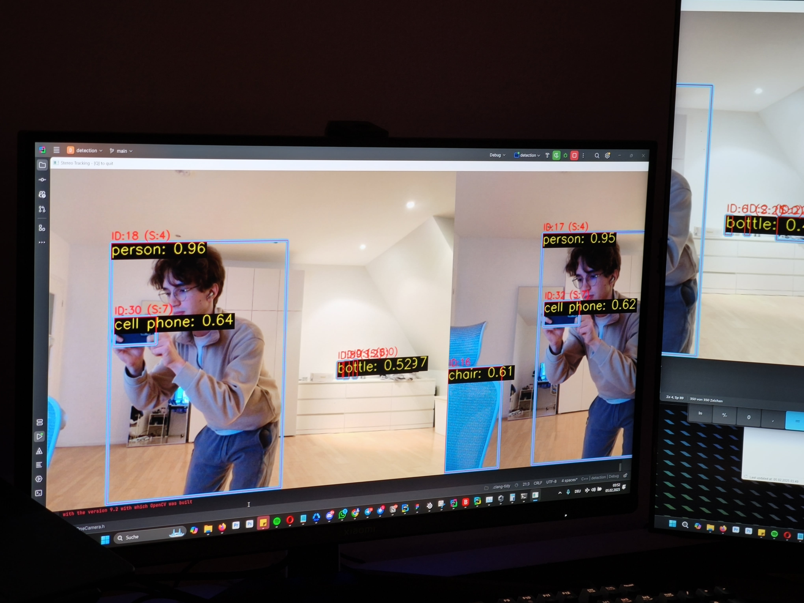

# Visionary

Experiments for object detection in real-time, using YOLO v8.

## C++ Setup
For C++, OpenCV is required.\
Easiest way to install that is by utilizing vcpkg package manager.\
Make sure to install the CUDA version supposing you have an Nvidia GPU.
Visual Studio 2022 project files are included. CMake is on the way.

## Python Setup
Python can be ran either with OpenCV or Ultralytics.
In both cases, it's sufficient to `pip install -r requirements.txt`

## Samples

  
  
Yolo v8 XL, 30ms inference result on RTX 3070 Ti Laptop, Laptop Camera Feed (real-time)

